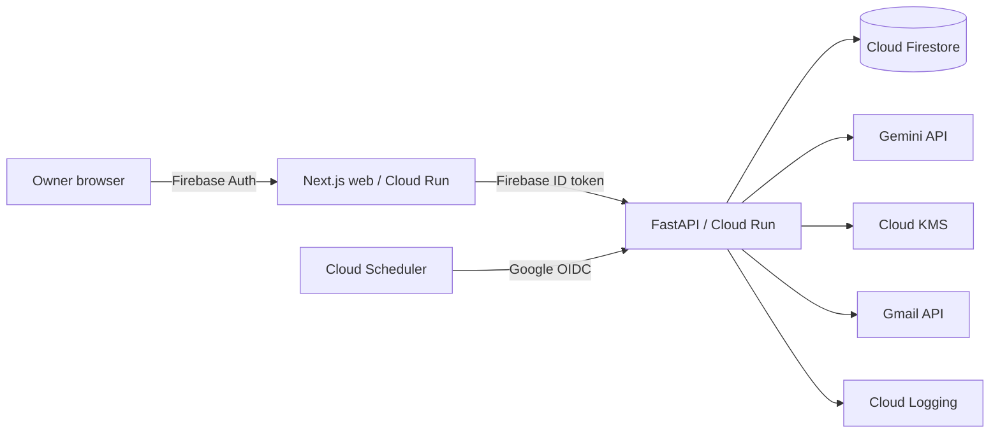

# Receivables Operator Preview

CashSathi is the internal codename for a constrained AI accounts-receivable operator for
Indian micro and small businesses. Public builds use **Receivables Operator Preview** until
the product name receives formal clearance.

The application turns a confirmed invoice into a policy-controlled AI decision, a real or
approval-gated action, and an auditable outcome. It is intentionally not a generic finance
chatbot, lender, credit-scoring system, legal service, or autonomous debt collector.

## Problem and Category

Small B2B businesses often leave receivables work with the owner: reading invoice terms,
remembering due dates, choosing a safe follow-up, tracking replies, confirming payment, and
handling exceptions. Receivables Operator Preview belongs in **Money & Financial Access**
because reliable access to already-earned cash affects a business's ability to pay workers,
buy inventory, and invest without requiring the product to make lending decisions.

## Working Product

- Transient PDF invoice processing with strict validation and owner confirmation.
- Gemini extraction and constrained next-action proposals with recorded model metadata.
- Deterministic cooldown, value, dispute, manual-only, legal-language, and payment policies.
- Gmail OAuth with KMS-encrypted refresh tokens and approval-gated delivery.
- Idempotent actions, explicit ambiguous-delivery handling, and scheduled rechecks.
- Owner-confirmed payments, invoice timelines, agent activity, approvals, and impact metrics.
- Tenant isolation, privacy export/deletion, optional evidence consent, and production alerts.
- Admin validation pipeline, Founder Recovery Plan ledger, and sanitized schema-v2 evidence ZIP.

Phase 8 is repository-ready but not launch-complete. Genuine customer evidence, public URLs,
screenshots, video, deployment verification, and external submission remain operator work;
the repository does not manufacture those claims.

## Architecture



Firebase identifies the user, while the API loads server-owned membership and derives the
business tenant. Browser clients cannot choose a `business_id` or access Firestore directly.
Gemini receives structured invoice state and proposes an allowed decision. Backend policy is
authoritative and executes tools only after validation or required human approval.

The PDF exists only during extraction. Operational evidence excludes PDF bytes, OAuth tokens,
reminder bodies, raw model/provider responses, and secrets. Money is stored as integer minor
units with an ISO currency code and is never silently converted.

See [architecture](docs/operations/architecture.md),
[privacy handling](docs/privacy/consent-and-data-handling.md), and
[evidence definitions](docs/evidence/events-and-metrics.md) for the detailed boundaries.

## Repository

- `apps/web`: Next.js 16 web application with Firebase Authentication.
- `services/api`: FastAPI API, Gemini orchestration, policy, tools, and Firestore repositories.
- `docs`: product, safety, privacy, evidence, validation, submission, and operations material.
- `infra`: Firebase, Cloud Build, Cloud Run, Scheduler, monitoring, and smoke-test tooling.

## Local Setup

Prerequisites: Node.js 24, Python 3.13 managed by `uv`, and Java 21 or later for Firebase
emulators.

1. Copy `apps/web/.env.example` to `apps/web/.env.local`.
2. Copy `services/api/.env.example` to `services/api/.env`.
3. Add a Gemini API key only when testing real extraction and decisioning.
4. Run `npm ci` and `uv sync --directory services/api --all-groups`.
5. Start Firebase emulators with `npm run emulators`.
6. In another terminal, seed two isolated demo tenants with `npm run seed`.
7. Start both applications with `npm run dev`.

Local endpoints:

- Web: <http://localhost:3000>
- API: <http://localhost:8000>
- Emulator UI: <http://localhost:4000>

When Auth and Firestore emulator hosts are configured, deterministic local adapters complete
the browser journey without calling Gemini, Gmail, or KMS. Real Gmail testing requires a
non-emulator development configuration, exact OAuth callback, Cloud KMS key, and application
default credentials.

## Quality and Release Gates

```text
npm run lint
npm run typecheck
npm test
npm run build
npm run verify:phase8:structure
```

The Phase 8 structure check validates the submission package without pretending its external
assets exist. After gathering a fresh production evidence archive and replacing every explicit
placeholder, run the final gate from a clean commit:

```text
npm run verify:phase8 -- --evidence-zip C:\controlled\cashsathi-evidence.zip
```

That command reruns lint, type checking, tests, and the production build; validates the
schema-v2 evidence archive, public URLs, screenshots, narrative, and demo timing; and writes an
untracked checksum manifest under `release-artifacts/`. It never tags, deploys, publishes, or
submits anything.

The repository-controlled launch package is in
[docs/submission/phase-8-package.md](docs/submission/phase-8-package.md). Production deployment
instructions are in [docs/operations/cloud-setup.md](docs/operations/cloud-setup.md), and alert,
rollback, deletion, and evidence procedures are in the
[production runbook](docs/operations/production-runbook.md).

## Judge Access

Provision a dedicated demo tenant with `services/api/scripts/provision_judge_account.py` and
supply its password only through the operator environment. Keep automation disabled by
default, label all demo records, and deliver credentials out of band. From a clean browser,
run `infra/gcp/smoke-production.ps1 -WebBaseUrl https://<web-service-url>` to verify sign-in,
dashboard isolation, agent activity, impact evidence, and privacy controls without sending an
email.

Admin evidence exports are access-controlled and are not a substitute for a judge tenant. The
operator must separately confirm repository access, deployment availability, video hosting,
and the live event's current form requirements.

## Security and Privacy

- Never commit `.env` files, service-account JSON, Firebase Admin keys, OAuth tokens, or receipts.
- Firestore browser rules deny all operational reads and writes; access runs through the API.
- Gmail refresh tokens are encrypted with Cloud KMS, and only the minimum send scope is used.
- Optional metrics, testimonial, and identity permissions are separate and withdrawable.
- Sanitized evidence separates demo, arms-length, related-party, pre-existing, and unclassified
  activity and includes identity/testimonial material only while consent is active.
- Payment after an action is timing correlation, not proof that the action caused recovery.

## Known Limitations

- One owner per business; no team-role UI in the first release.
- Manual payment confirmation, outreach, receipts, expenses, and customer validation.
- Gmail delivery may be ambiguous and is deliberately never retried automatically in that state.
- No native mobile application, voice calling, accounting integration, lending, credit scoring,
  negotiation, automated legal action, or coercive collections.
- Production deployment and genuine Phase 7/8 evidence cannot be completed by source code alone.
