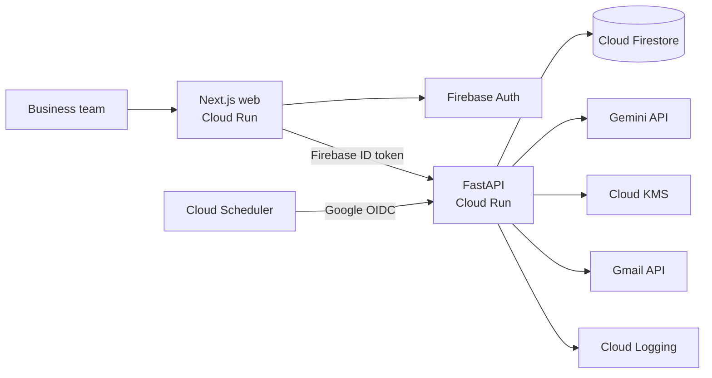

# Receivables Operator Preview

**Receivables Operator Preview** is a policy-controlled AI accounts-receivable operator for
Indian micro and small businesses. CashSathi is the project's internal codename; the public
name remains provisional until formal naming clearance.

The product helps a business turn a confirmed invoice into a safe next action, a controlled
Gmail follow-up, and an auditable outcome. It is designed for B2B agencies and consultancies
that manage receivables without a dedicated collections team.

This is a **Money & Financial Access** product: it helps businesses collect cash they have
already earned. It does not provide loans, credit scores, legal advice, or autonomous debt
collection.

## Why it exists

For a small business, receivables work often lives across invoices, spreadsheets, inboxes,
and the owner's memory. Someone still has to read payment terms, remember due dates, choose a
relationship-safe follow-up, track exceptions, and prove what happened.

Receivables Operator Preview brings that workflow into one controlled system. Gemini can
extract invoice facts and propose an allowed next step, but deterministic backend policy
decides whether the system may proceed, must wait, or needs a human.

## How it works

1. A team member uploads a PDF invoice. The API validates it, extracts a draft with Gemini,
   and discards the PDF bytes after the request.
2. A human reviews and confirms the customer, amount, currency, invoice number, and due date.
3. Gemini proposes a structured function call for the next action. The proposal includes
   model and prompt metadata for the audit trail.
4. Backend policy applies cooldown, high-value, dispute, customer, language, payment, and
   automation rules. Policy is authoritative over model output.
5. An allowed reminder is queued for approval or delivered through Gmail. Cloud Scheduler
   rechecks invoices that are due for evaluation.
6. A human records verified payments. Timelines, impact metrics, forecasts, and exports are
   built from the resulting evidence without claiming that timing proves causation.

## Current product capabilities

### Invoice intelligence and controlled actions

- Transient PDF processing with 10 MiB and 25-page limits, editable extraction results, and
  mandatory human confirmation before an invoice becomes operational data.
- Gemini extraction and explicit next-action function calls with schema validation, bounded
  retries, prompt versions, model names, and recorded decision metadata.
- Deterministic invoice states and restriction-only policy controls. Owners and administrators
  may make cooldowns or approval thresholds more cautious, but cannot weaken saved safeguards.
- Per-customer manual-only controls, English (India) and Hindi (India) reminder templates, and
  explicit dispute opening and resolution workflows.
- Gmail OAuth using the minimum send scope, PKCE, and Cloud KMS-encrypted refresh tokens.
- Approval-gated delivery, idempotent actions, scheduled rechecks, and explicit handling for
  ambiguous delivery. An uncertain send is never retried automatically.

### Team operations

The application supports invitation-based, least-privilege membership with four roles:

| Role | Intended access |
| --- | --- |
| Owner | Full business control, including owner-only consent, privacy, and team decisions. |
| Admin | Manages daily operations, approvals, integrations, policies, and non-owner team access. |
| Operator | Runs invoice, customer, dispute, payment, and action workflows without administrative control. |
| Advisor | Reviews business, impact, and finance information; sensitive reminder copy is redacted. |

Invitations expire after seven days. Membership changes and revocation are enforced by the
API, and a revoked member immediately loses tenant access.

### Evidence, finance, and privacy

- Human-confirmed payments, invoice timelines, agent activity, approval history, and impact
  metrics separated by currency.
- Deterministic 4-, 8-, and 12-week cash forecasts based on confirmed due dates and observed
  payment delay; model output cannot change forecast values.
- A privacy-filtered finance readiness ZIP containing aging, verified payments, policy/action
  history, forecast data, methodology, and a manifest.
- Admin validation records, a Founder Recovery Plan ledger, and sanitized schema-v2 evidence
  exports for controlled evaluation.
- Firebase email/password authentication with account creation, sign-in, and password reset.
- Versioned product and optional evidence consent, account export and deletion, tenant
  isolation, rate limits, request deadlines, production readiness checks, and alerts.

## Safety boundaries

| Guardrail | Enforced behavior |
| --- | --- |
| Reminder cooldown | No automatic reminder inside the configured cooldown window. |
| High-value invoice | Requires human approval at or above the configured threshold. |
| Manual-only customer | Every action requires a human. |
| Active dispute | Automation stops until an authorized user records a resolution. |
| Legal or threatening language | Prohibited by immutable policy. |
| Payment status | Only a human-confirmed payment can close an invoice. |
| Invalid model output | One bounded retry, then human review. |
| Ambiguous Gmail delivery | Marked unknown and never automatically resent. |

Money is stored as integer minor units with an ISO 4217 currency code and is never silently
converted. Operational evidence excludes PDF bytes, OAuth tokens, reminder bodies, raw model
or provider responses, and secrets. See the detailed [policy baseline](docs/product/policies.md),
[privacy model](docs/privacy/consent-and-data-handling.md), and
[evidence definitions](docs/evidence/events-and-metrics.md).

## Architecture



The browser authenticates with Firebase, while the API derives the business tenant from
server-owned membership data. Clients cannot select a `business_id`, and Firestore browser
rules deny access to operational data. Gemini proposes structured decisions; the FastAPI
policy and workflow layers validate them before any tool can run.

The complete design and trust boundaries are documented in
[the architecture decision](docs/operations/architecture.md).

## Repository layout

- `apps/web`: Next.js 16 and React 19 web application with Firebase Authentication.
- `services/api`: FastAPI service, Gemini orchestration, policy engine, integrations, and
  Firestore repositories.
- `infra`: Firebase rules and indexes, Cloud Build, Cloud Run, Scheduler, monitoring, CI, and
  smoke-test tooling.
- `docs`: product, safety, privacy, evidence, validation, deployment, and submission material.
- `release-artifacts`: repository-controlled test and release-verification inputs.

## Local development

### Prerequisites

- Node.js 24 and npm
- Python 3.13 with [`uv`](https://docs.astral.sh/uv/)
- Java 21 or later for the Firebase emulators

### Setup

1. Copy `apps/web/.env.example` to `apps/web/.env.local`.
2. Copy `services/api/.env.example` to `services/api/.env`.
3. Install the JavaScript and Python dependencies:

   ```text
   npm ci
   uv sync --directory services/api --all-groups
   ```

4. Start Firebase Auth and Firestore emulators:

   ```text
   npm run emulators
   ```

5. In a second terminal, seed two isolated demo tenants and start both applications:

   ```text
   npm run seed
   npm run dev
   ```

Local services are available at:

- Web: <http://localhost:3000>
- API: <http://localhost:8000>
- Firebase Emulator UI: <http://localhost:4000>

With the emulator hosts enabled, deterministic local adapters support the full browser flow
without calling Gemini, Gmail, or KMS. A Gemini key is only needed for real extraction and
decision testing. Real Gmail delivery additionally requires an exact OAuth callback, a Cloud
KMS key, application default credentials, and a non-emulator development configuration.

Never commit `.env` files, service-account JSON, Firebase Admin credentials, OAuth tokens, or
payment receipts. Firebase web configuration in `NEXT_PUBLIC_*` variables is public client
configuration, not an Admin credential.

## Quality gates

Run the repository-wide checks from the project root:

```text
npm run lint
npm run typecheck
npm test
npm run build
```

Firestore rules and browser end-to-end tests are available separately:

```text
npm run test:rules
npm run test:e2e
```

## Deployment and submission readiness

Phase 9 is the current product capability layer: it adds explicit Gemini function calls,
restriction-only policy and customer controls, dispute handling, team roles, bilingual
templates, deterministic forecasts, finance exports, and fail-closed accounting contracts.

The Phase 8 submission package and verifier keep their existing names. Validate the
repository-controlled structure with:

```text
npm run verify:phase8:structure
```

After collecting a fresh production evidence archive and replacing every explicit
placeholder, run the final gate from a clean commit:

```text
npm run verify:phase8 -- --evidence-zip <path-to-evidence.zip>
```

The final gate reruns linting, type checking, tests, and the production build; validates the
evidence archive and submission assets; and writes an untracked checksum manifest under
`release-artifacts/`. It does not deploy, publish, tag, or submit the project.

Use the [cloud setup guide](docs/operations/cloud-setup.md) and
[production runbook](docs/operations/production-runbook.md) for deployment. The
[Phase 8 package](docs/submission/phase-8-package.md) records the repository-controlled
submission narrative and outstanding evidence requirements.

## Current status and limitations

The repository contains a working, tested product and deployment tooling, but it does not
claim launch completion. Genuine customer evidence, live public URLs, screenshots, a hosted
demo video, production verification, event registration, and external submission remain
operator responsibilities.

- Zoho Books and TallyPrime expose explicit `NOT_CONFIGURED` contracts only. Sync attempts
  fail closed until an owner approves an integration and credentials are provisioned.
- Payments, dispute resolution, customer validation, and ambiguous Gmail delivery resolution
  require a human.
- Payment following a reminder is reported as timing correlation, not proof that the product
  caused recovery.
- There is no lending, credit scoring, negotiation, automated legal action, coercive language,
  voice calling, native mobile application, or full accounting/ERP integration.
- A model cannot independently send an unapproved action, weaken policy, resolve a dispute,
  infer payment, or close an invoice.
