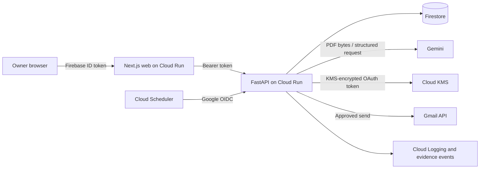

# Receivables Operator Preview — Phase 8 Package

### ⏳ Not submitted yet

Nothing has been sent to Devpost. This repository document is a working package, not an
official form response. The public product name remains **Receivables Operator Preview**
until the CashSathi name receives formal clearance.

## Claim Status

Production traction, revenue, expenses, testimonials, screenshots, public URLs, and video
are not yet verified in this workspace. Replace `VERIFY_FROM_EVIDENCE_EXPORT` only from a
fresh `cashsathi-evidence.zip`. Never promote demo records, related-party activity,
pre-existing relationships, or post-action timing into arms-length or causal claims.

## Release Candidate Freeze

- Freeze the release candidate only after `npm run verify:phase8 -- --evidence-zip <path>`
  passes from a clean commit.
- After the freeze, accept only critical security, data-integrity, availability, or
  judge-blocking fixes. Each fix must repeat the complete release verification.
- Do not tag, deploy, publish assets, or send anything to Devpost from the verifier.
- Store the generated `release-artifacts/phase8-release-manifest.json` with the controlled
  release evidence; the directory is intentionally untracked.

## Repository and Judge Access

- Public repository: `TODO_REPOSITORY_URL`
- Public demo: `TODO_PUBLIC_DEMO_URL`
- Demo video: `TODO_VIDEO_URL`
- Judge credentials: deliver out of band; never put passwords or reset links in this file.
- Judge data: use a clearly labelled demo tenant with automation disabled by default.

For a private repository, grant the event's live, officially confirmed judging accounts
access after checking the current form requirements. Do not infer addresses from this
template. Before making the repository public, run the secret-history scan and confirm
that `.env`, OAuth tokens, service-account files, and customer evidence are absent.

## Architecture



Gemini extracts invoice facts and proposes a constrained next action. Deterministic
backend policy remains authoritative: it can wait, require human review, block unsafe
language, enforce cooldowns, or allow a reminder. The application—not the model—executes
tools and records the outcome. Firestore client access is denied; every business-scoped
operation is derived from authenticated membership on the API.

## Testing Instructions

Use Node.js 24, Python 3.13 with `uv`, and Java 21 or later for Firebase emulators.

```text
npm ci
uv sync --directory services/api --all-groups
npm run lint
npm run typecheck
npm test
npm run build
```

For the full local browser journey, start the Firebase Auth and Firestore emulators, seed
the deterministic tenants with `npm run seed`, start the app with `npm run dev`, and run
`npm run test:e2e`. Local adapters do not call Gemini, Gmail, or KMS. Production judge
verification uses `infra/gcp/smoke-production.ps1` with credentials supplied only through
the operator shell.

## 500–1,000-Word Narrative Template

<!-- NARRATIVE_START -->
Receivables Operator Preview is a constrained AI accounts-receivable operator for Indian
micro and small businesses. It begins with a practical problem: a completed job and an
issued invoice do not automatically become cash. Owners still need to review invoice
terms, remember due dates, decide when to follow up, preserve customer relationships,
track replies, confirm payments, and recognize when a dispute needs human judgment. A
larger company can assign this queue to a finance team. A small agency, consultancy,
contractor, wholesaler, or manufacturer often leaves it with the founder.

The product turns that repeated work into an auditable operating loop. An owner uploads
an invoice PDF after accepting the processing boundary. Gemini extracts fields such as
invoice number, customer, amount, currency, issue date, due date, and payment terms into
a strict schema. The PDF is processed transiently rather than retained by default. The
owner reviews and corrects every extracted fact before the application saves an invoice.
This confirmation step matters because a plausible model output is not the same as a
verified financial record.

Once confirmed, the application calculates invoice state deterministically and gives
Gemini structured context: dates, current status, policy settings, and recent action
history. Gemini proposes one bounded decision—wait, send a reminder, schedule a recheck,
request human review, or close only when payment has been confirmed. The backend then
evaluates that proposal against explicit policy. Reminder cooldowns, high-value
thresholds, manual-only customers, missing recipient details, disputes, non-INR work,
legal language, and uncertain delivery can all block automation or require approval.
Gemini proposes; application policy authorizes; the tool adapter executes.

That separation makes the AI operational without pretending it is unlimited. A permitted
reminder can become a real Gmail action, while a sensitive case appears in the approval
queue. Every run records the model and prompt version, proposal, concise rationale,
policy result, action state, timestamps, and sanitized provider outcome. If delivery is
ambiguous, the action becomes unknown and is never blindly retried. When the owner records
a verified payment, the invoice closes and future reminders stop. The activity timeline
lets an operator or judge follow extraction, decision, policy, approval, action, and
payment as one trace.

The project uses Google Cloud as production infrastructure rather than as a logo in the
stack. Separate Next.js and FastAPI services are designed for Cloud Run. Firestore holds
tenant-isolated operational records and append-oriented evidence. Secret Manager supplies
runtime secrets, Cloud KMS encrypts Gmail refresh tokens, Cloud Scheduler invokes rechecks
with Google OIDC, and Cloud Logging supports error, model, Gmail, scheduler, and cost
alerts. Firebase Authentication identifies the user, but the API derives the business
membership server-side so callers cannot select another tenant in a request.

AI also changed how the product was built. Codex was used to inspect the existing
architecture, implement bounded features, add regression coverage, run linting and type
checks, and challenge claims that were not supported by data. During Phase 8 it helped
turn the evidence ledger into a versioned export with a monthly P&L, customer validation
breakdown, conservative claim notes, and a release verifier. The human remained
responsible for product scope, policies, credentials, customer consent, production
operations, and every external publication decision.

The current commercial and impact statements must come only from the fresh evidence
archive: `VERIFY_FROM_EVIDENCE_EXPORT`. That archive separates arms-length, related-party,
pre-existing, unclassified, and demo activity; reports revenue and expenses in integer
minor units without currency conversion; and exports testimonials only while their
channel-specific consent is active. A payment after a logged reminder is reported as
post-action timing, never proof that the reminder caused payment. Until those records and
the public assets are independently checked, this document makes no traction claim.

The project belongs in Money & Financial Access because reliable access to cash starts
before credit. Small businesses have less room to pay workers, buy inventory, or invest
when completed work remains trapped in overdue receivables. Receivables Operator Preview
does not make lending decisions, threaten legal action, negotiate disputes, or claim to
replace accountable people. It gives small businesses a controlled first-line operator
for repetitive receivables work while owners retain policy, relationship, and exception
decisions. The result is a narrow, testable application of AI: understand a real invoice,
choose an allowed next step, execute or gate that step, and preserve evidence of what
actually happened.
<!-- NARRATIVE_END -->

## Screenshot Shot List

Replace these entries with three to five privacy-reviewed images. Crop browser chrome only
when doing so does not hide the intended device or material state.

1. Dashboard with demo/real classification visible:
   
2. PDF extraction review with non-sensitive sample data:
   
3. Invoice decision showing Gemini rationale and policy result:
   
4. Agent activity showing chronological production evidence:
   
5. Impact view with authentic metrics and category labels:
   

Do not show customer names, email addresses, invoice references, OAuth details, access
tokens, judge credentials, receipt references, or unconsented testimonial text.

## Sub-Three-Minute Demo Script

| Time | Screen | Narration objective |
| --- | --- | --- |
| 0:00–0:15 | Landing and one overdue-invoice scenario | Establish the small-business receivables burden and product promise. |
| 0:15–0:45 | Upload a privacy-safe PDF and review extracted fields | Show live Gemini document understanding and mandatory owner confirmation. |
| 0:45–1:15 | Evaluate the confirmed invoice | Show the bounded AI proposal, rationale, risk flags, and next check. |
| 1:15–1:40 | Policy result and approval queue | Demonstrate deterministic cooldown, value, dispute, and human-control boundaries. |
| 1:40–2:00 | Controlled Gmail action result | Prove an approved decision becomes a logged tool action; use a controlled recipient. |
| 2:00–2:20 | Agent activity and invoice timeline | Connect model decision, policy validation, tool result, and audit evidence. |
| 2:20–2:40 | Impact and sanitized evidence export | Show only authentic scoreboard values and label demo data explicitly. |
| 2:40–2:55 | Architecture and category close | Explain why better receivables operations support Money & Financial Access. |

Record on the intended device, keep the final edit below three minutes, use no unlicensed
music or third-party material, and host it only after reviewing every visible record.

## Evidence Checklist

- [ ] Generate a fresh `cashsathi-evidence.zip` from the production admin account.
- [ ] Confirm `manifest.json` reports schema version 2 and `complete: true`.
- [ ] Reconcile `pnl_by_month.csv` against controlled receipts and expense records.
- [ ] Review `customer_breakdown.csv` for segment and relationship accuracy.
- [ ] Copy claims only from `submission_metrics.json`; keep currencies separate.
- [ ] Confirm testimonial and identity permissions are active for the intended channel.
- [ ] Verify screenshots and video reveal no customer or credential data.
- [ ] Run release verification from a clean commit and retain its checksums.

## Judging-Period Operations

- Keep the Cloud Run services, Firebase Authentication, Firestore, Gmail OAuth client, and
  scheduler available for the entire judging window confirmed by the live event data.
- Monitor API 5xx, model/schema failures, Gmail failures, scheduler heartbeat, and billing
  alerts. Follow the production runbook rather than improvising a resend.
- Check the submission contact inbox daily and respond to verification requests within the
  event's stated window.
- Preserve judge access, the frozen evidence ZIP, release manifest, and matching commit.
- If rollback is required, pause the scheduler, route traffic to the previous known-good
  Cloud Run revision, run one authenticated recovery check, and record the event.

## Known Limitations

- Production deployment and external service configuration are operator responsibilities.
- Payment confirmation, revenue receipts, expenses, and founder-led outreach are manual.
- Gmail delivery can be ambiguous and deliberately requires manual resolution.
- The first release supports one owner per business and does not provide native mobile,
  voice calls, accounting integrations, credit scoring, lending, or automated legal action.
- Post-action payment is correlation by time, not proof of recovery causation.
- The repository package is not release-ready while any `TODO_*` or
  `VERIFY_FROM_EVIDENCE_EXPORT` marker remains.

## TODO Official Form Fields

The live Devpost requirements have not been loaded because `.devpost-hackathon-state.json`
does not exist. After `$start-hackathon` and `$review-hackathon-rules`, use
`$prepare-submission` to create the event-specific `devpost-submission.md`. Record any
official custom fields, track/category identifiers, and confirmed Codex session ID there;
do not invent them in this repository template.
